
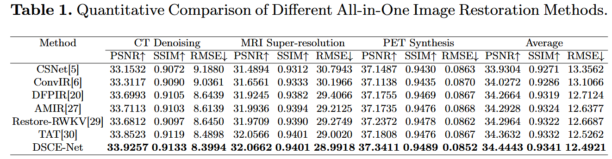
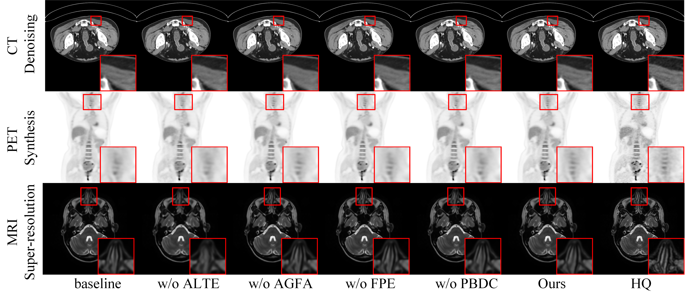
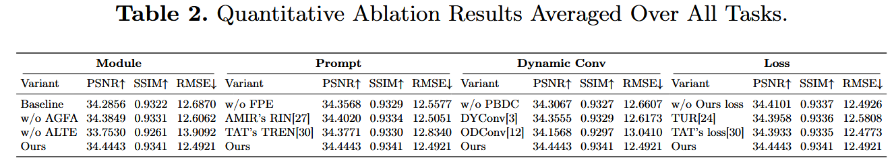

# DSCE-Net: Dual-Scale Conditioned Evolving  Network with Balanced Optimization for All-in-One Medical Image Restoration(DSCE-Net)


## Network Architecture



## result and Visualization





## Dataset
if you want,ask me


## Citation


## 配置环境
```
--conda env create -f .yaml文件 --name myenv
```
## 训练

```
python train.py
```

## 测试

```
python test.py
```
